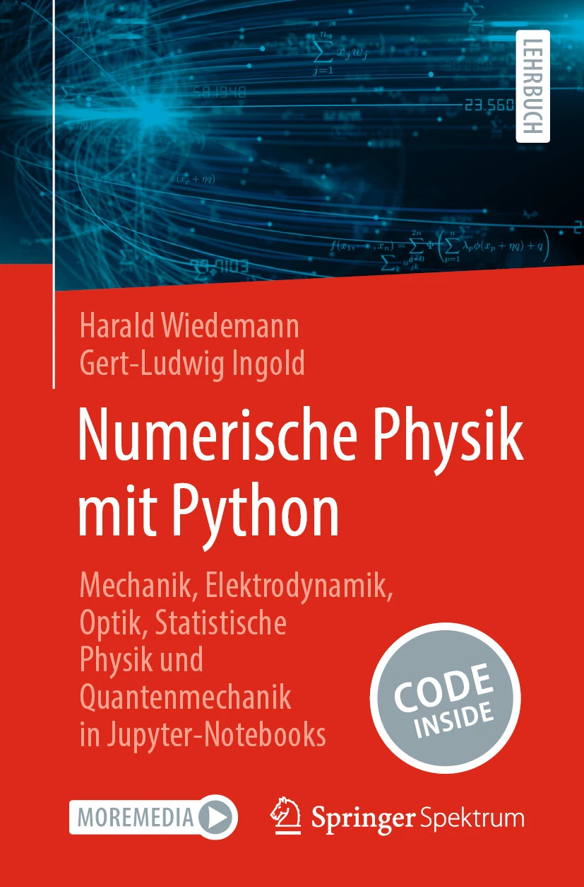

# numerische-physik-mit-python-1

Hier finden Sie die Jupyter-Notebooks zum [Lehrbuch "Numerische Physik mit Python" von Harald Wiedemann und Gert-Ludwig Ingold](https://link.springer.com/book/10.1007/978-3-662-69567-8) (Springer Spektrum, 2025).

### Inhalt

* **config**   
    Hier liegt die auf Seite 343 des Buchs abgedruckte Datei `environment.yml`. Der Name `myenv` kann ggf. abgeändert werden.
* **notebooks**   
    Hier liegen die Jupyter-Notebooks sowie die Datei `numphyspy.style`, die Festlegungen für `matplotlib` zur Verwendeung
    in den Jupyter-Notebooks enthält.
